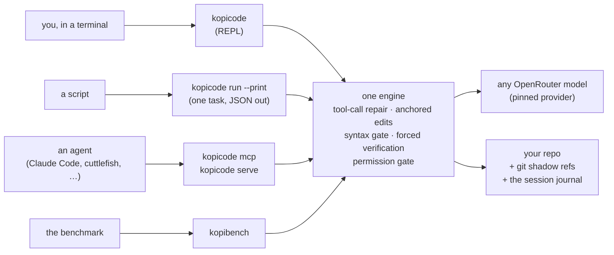

https://github.com/user-attachments/assets/c85718fa-2d2d-4c0d-8151-833ca1d6fe24

# kopicode

A terminal coding agent, and a harness you can tune per model. kopicode is built to make
cheap open-weight models code reliably: it repairs malformed tool calls, edits through
hash anchors that reject on drift instead of guessing, syntax-checks every edit, and will not
report success until your project's own tests pass. One engine runs the same way from your
terminal, a script, or another agent.



**Status:** v0.3, with recorded runs on real repositories in
[`docs/dogfood-runs/`](docs/dogfood-runs/). Two models are measured on the corpus; four are
registered. There is no sandbox: an approved shell command runs with your
privileges ([why](docs/adr/0008-shell-isolation-accepted-risk.md)). Questions and bugs go in
the [issue tracker](https://github.com/leejianrong/kopicode/issues).

## Quick start

You need an [OpenRouter](https://openrouter.ai/keys) API key. The pre-built binary needs
nothing else; building from source needs Go 1.26 or later.

```bash
# install the latest release into ~/.local/bin (checks it against SHA256SUMS)
curl -fsSL https://raw.githubusercontent.com/leejianrong/kopicode/main/scripts/install.sh | sh

# or build from source
git clone https://github.com/leejianrong/kopicode.git && cd kopicode && make build   # -> bin/kopicode

export OPENROUTER_API_KEY="..."   # read from the environment only; a .env file is not loaded
cd your-project
kopicode                          # starts the REPL in the current directory
```

Type a task at the prompt. The model reads files, proposes edits and, when it needs to, runs
a shell command. Two things always stop and ask first: running a shell command, and writing
outside the project. Edits inside the project are the agent's job and are not gated.

```
[perm] run_shell needs your consent
       command: go test ./...
allow? [y]es / [N]o / [a]lways for this exact request, or type what to do instead:
```

`y` allows this call; `a` allows that exact request for the session (an exact match, never a
directory or a command prefix); Enter or `n` denies. Anything else you type also denies, and
the text goes to the model as a suggestion: `use uv and a venv` (or `no, use uv`) refuses the call and
tells the agent what you want instead. A sentence that starts with "yes" is still a suggestion, never a yes. `Ctrl-C` cancels the
turn in flight without ending the session; `/context` shows how much of the model's window the session is using, what it has spent and the
provider-reported cost; `/mode auto` (or `kopicode --mode auto`) stops the prompts for shell inside the project, keeping a fixed never-allow list, and `/mode default` brings them back; `/exit` (or `/quit`) ends it. Your first task is best a small, well-described
bug in a repo with tests: [`docs/trying-kopicode.md`](docs/trying-kopicode.md) walks through
two real ones. A one-line fix cost about $0.04.

## Usage

**Interactively**, as above. Pick a model with `--model` (default `qwen/qwen3-coder-next`;
`minimax/minimax-m2`, `z-ai/glm-5.2` and the cheap `deepseek/deepseek-v3.2` are also
registered, and an unknown id is refused at startup with the list printed). Pin a repository's choice so everyone gets the same one:

```toml
# .kopicode/config.toml
model = "minimax/minimax-m2"
```

Precedence is `--model` / `--harness`, then this file, then your user config (below), then the
built-in default. No environment variable is in that chain.

**Your own defaults** live in `~/.config/kopicode/config.toml` (`$XDG_CONFIG_HOME/kopicode` or
`$KOPICODE_HOME` if set). Only the interactive `kopicode` reads it; `run --print`, `serve`, `mcp`
and `kopibench` never do, so your preferences cannot change what a script or a benchmark runs.

```toml
model = "minimax/minimax-m2"
default_mode = "auto"                      # start in auto mode (see /mode)
auto_never_allow = ["terraform apply"]     # added to the built-in list, never replacing it
skills_paths = ["~/work/shared-skills"]    # more places to look for skills
```

`auto_never_allow` also works in a repository's file and the two lists add up. `default_mode` and
`skills_paths` are refused there: a repository must not decide how much its visitors are asked.
An `AGENTS.md` beside the user config is given to the model before the repository's own, and is
recorded in the journal. [ADR-0024](docs/adr/0024-user-level-config.md).

**As a one-shot**, with the record as newline-delimited JSON on stdout:

```bash
kopicode run --print "fix the failing test in ./parser"
```

It refuses shell commands and out-of-project writes unless a policy file says otherwise
([wire and exit codes](docs/run-print-protocol.md)).

**From another agent**, as an MCP server. Four tools, session events as progress
notifications, and a required `consent_mode` that says who answers permission requests:

```bash
claude mcp add kopicode -- kopicode mcp
```

kopicode reads `OPENROUTER_API_KEY` from the environment it is launched with. If your client
does not pass yours through, give it the key with the client's own option (for Claude Code,
`-e OPENROUTER_API_KEY=...`, which stores the key in that client's config).

`kopicode serve` is the same sessions over NDJSON JSON-RPC for an orchestrator that spawns
kopicode as a child; `kopicode version --json` lists the protocol version and the features
your binary supports, so a client can require one. See [`docs/kopicode-mcp.md`](docs/kopicode-mcp.md) and
[`docs/kopicode-serve-protocol.md`](docs/kopicode-serve-protocol.md).

A session is bounded: each prompt gets at most **20 model calls** (the turn cap) and the
session at most 2M tokens. A task that needs more ends with `stop: max_turns` rather than
running on; the work done so far stays in the tree, and replying continues it with a fresh
allowance. To raise the cap for a repository, declare `max_turns` in a harness config
([`docs/harness-tuning.md`](docs/harness-tuning.md)).

## How unattended sessions are kept safe

Nobody is at a terminal to say yes, so a caller picks one of three answerers for shell
commands and writes outside the project:

| `consent_mode` | Who answers | Use it for |
| --- | --- | --- |
| `auto` | the harness: shell inside the project runs; a fixed never-allow list (`sudo`, `rm` outside the project, forced `git push`, a download piped into a shell, writes outside, a global `pip`/`npm` install, `git reset --hard`, `--no-verify`) is refused | your own repo, on your own machine |
| `remote_interactive` | the calling agent, per action, live | open-ended work with a supervisor |
| `unattended_policy` | a declared allowlist (`--policy-file`) | a fixed, known set of commands |

Command lines are tokenized, every command in them is checked, and anything that cannot be
analysed is refused. None of this is a sandbox; real containment is the caller's job
([ADR-0017](docs/adr/0017-auto-consent-mode.md), [ADR-0018](docs/adr/0018-tokenized-allowlist.md)).

## Why a harness, and what it has measured

A model's harness (prompt structure, tool surface, parse-and-repair, verification loop) moves
its measured coding ability by a large margin, and open-weight models have the most headroom
because they get the least harness attention. The gains kopicode bets on are generic
reliability work, in order of expected payoff:

1. **Tool-call parse-and-repair.** Weak models emit malformed JSON and invented tool names;
   accepting several formats and feeding back a specific error beats burning the turn.
2. **An edit tool where the model never reproduces file content.** `read_file` returns
   per-line anchors and `edit_file` rejects when they no longer match
   ([ADR-0006](docs/adr/0006-hash-anchored-edits-and-failure-attribution.md)).
3. **Forced verification.** The loop runs your tests after edits and will not report success
   without them.

Measured, not asserted: on the frozen 13-task corpus both pinned arms
(`qwen/qwen3-coder-next` and `minimax/minimax-m2`) pass 12 of 13 and fail the *same* task, for
about $0.17 and $0.29 a run. The corpus does not yet separate the two models; the result and
what it says about the corpus are in
[`docs/paired-ab-qwen-vs-minimax-m2-v2.md`](docs/paired-ab-qwen-vs-minimax-m2-v2.md). Every
number comes from a pinned provider and quantization, because an unpinned A/B is not
evidence ([`docs/provider-pin.md`](docs/provider-pin.md)). You can rerun it free against a
mock provider with `make bench-smoke`.

## Configuration

| Setting | Where | Notes |
| --- | --- | --- |
| `OPENROUTER_API_KEY` | environment | required; never written to the journal or logs |
| `model`, `harness`, `harness_config` | `.kopicode/config.toml` or flags | flags win; `model` can also come from the user config |
| `default_mode`, `auto_never_allow`, user `AGENTS.md` | `~/.config/kopicode/` | interactive `kopicode` only |
| turn cap and other bounds | a declared harness config (`--harness-config`) | for example `max_turns = 40` when a session stops with `max_turns`; local-only, never anchors a published number. See [`docs/harness-tuning.md`](docs/harness-tuning.md) |
| per-language examples | [`docs/examples/`](docs/examples/) | Go, JavaScript/TypeScript, Python, multi-language |
| skills: reusable task instructions | `<name>/SKILL.md` under `.agents/skills`, `.kopicode/skills`, `~/.config/kopicode/skills`, or `skills_paths` in the user config; `~/.claude/skills` and `~/.agents/skills` are read as fallbacks | the convention Claude Code, Codex and Cursor read. `/skills` lists them, `/<name> [task]` runs one, Tab completes the name. A repository's skill beats a personal one of the same name. The model is also shown the ones inside the project once per session. Interactive `kopicode` only ([ADR-0014](docs/adr/0014-skills-mechanism.md), [ADR-0025](docs/adr/0025-skills-discovery-and-commands.md)) |

`kopicode sessions` lists past sessions; `--resume <id>` and `--fork <id>:<turn>` continue or
branch one. Every session is a journal under `.kopicode/sessions/`; everything printed is
derived from it.

## Documentation

- [`docs/trying-kopicode.md`](docs/trying-kopicode.md) — first tasks, with real repositories
- [`docs/adr/`](docs/adr/README.md) — every decision and why, one page each
- [`docs/background.md`](docs/background.md) — prior art, what is deliberately not being
  built, and the history behind the design
- [`docs/PRD.md`](docs/PRD.md) — requirements and scope
- [`docs/RELEASING.md`](docs/RELEASING.md) — how a release is cut

## Contributing

Read [`CONTRIBUTING.md`](CONTRIBUTING.md) for setup and workflow. Agents working in this
repository follow [`AGENTS.md`](AGENTS.md).

## Licence

Apache-2.0. See [`LICENSE`](LICENSE).
